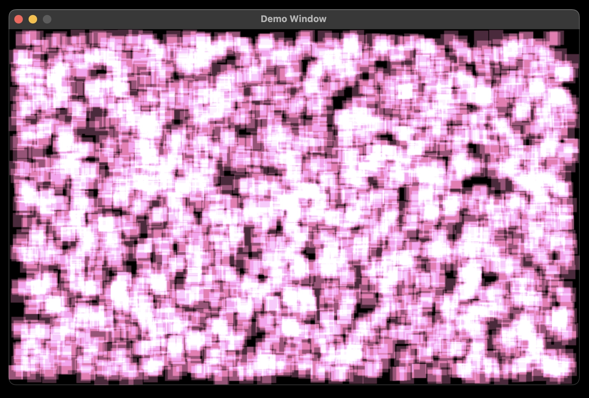

## Odin Lang + SDL3



This is a basic demo, using the hardware accelerated SDL3 2D rendering API, for the Odin programming language

See: https://odin-lang.org
See: https://wiki.libsdl.org/SDL3/FrontPage

### Requirements

For Windows OS, you will need to do a bit of research to install these dependencies

- [Odin](https://formulae.brew.sh/formula/odin)
- [SDL3](https://formulae.brew.sh/formula/sdl3)

```
brew install odin
brew install sdl3
```

You may need to change the SH file permissions so they can be executed on your machine:

```
chmod +x ./run.sh
chmod +x ./run_debug.sh
```

To run the demo from a CLI:

```
./run.sh
```

To run the demo in debug mode (slower) from a CLI:

```
./run_debug.sh
```
